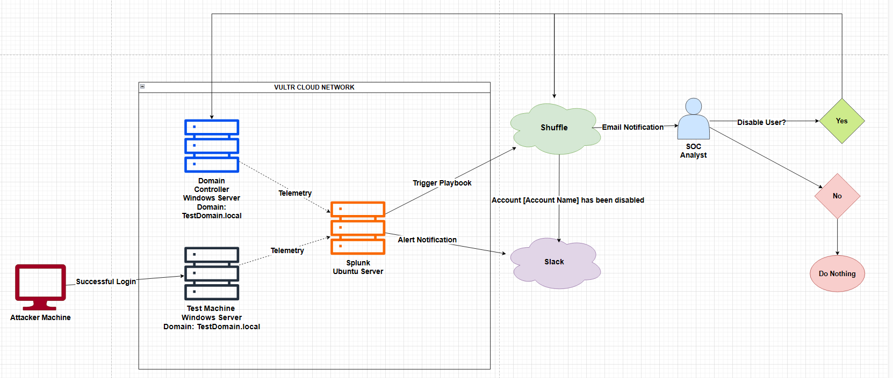
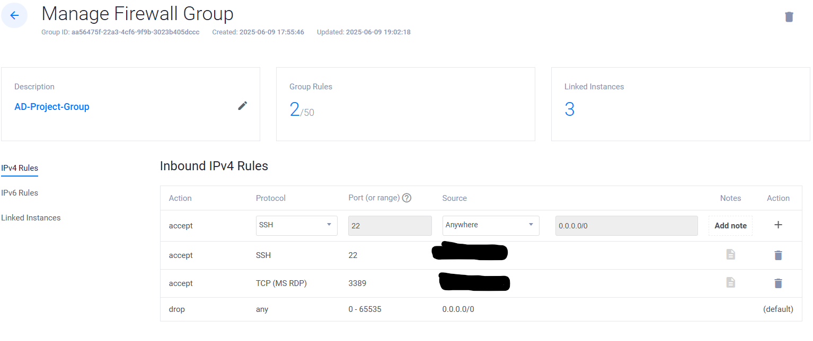

Text can be **bold**, _italic_, ~~strikethrough~~ or `keyword`.

# Introduction

In this project I will be setting up three virtual machines. The first machine will be our domain controller which will be taking responses from our shuffle based on our response as the SOC analyst if we want to disable a users account due to a succesful anuthorized login attempt. Shuffle will automate this task so that we can disable a users account and the domain controller will disable the account through Active Directoy(AD) so that we can disable an account in just one click. The next virtual machine will just be a windows VM that will be open to forms of attack like having the RDP port (3389) open and having weak user credentials to simulate how an attacker could brute force into a users account and gain unauthorized login. The last virtual machine will be a machine to run splunk on an Unbuntu server where the domain controller and the user virtual machine will send telemetry for splunk to collect. Now that the machines our setup and we have an attack vector against our user machine, we are going to setup the alert notifications. I setup splunk to send an alert notification to Slack when there have been attempt of an authorized successful login, aswell as trigger the playbook that I createrd within Shuffle. Our playbook will send an email to us the SOC analyst giving us the choice of if we want to disable the users account within the incident we are reviewing. If I select yes, Shuffle will automate the process and intruct the domain controller to disable the users accont and then will send a notification to Slack that the specified users acocunt was disabled. If I say no to the incident we will do nothing and the users account will stay enabled. 

# Setting Up Machines and Firewall Rules

To start, im using Vultr to create my virtual machines in their cloud platform. After creating the machines I need to setup the machines so that they can communicate with each other and that I am the only one that can communicate with them for the time being. To do this I setup a firewall group to add all of the machines to and created policys to allow me to connect to them from my PC. Below is an image of the basic policy rules I setup to allow me to SSH into the Splunk Ubuntu server and be able to Remote Desktop into the domain controller and user PC. 

