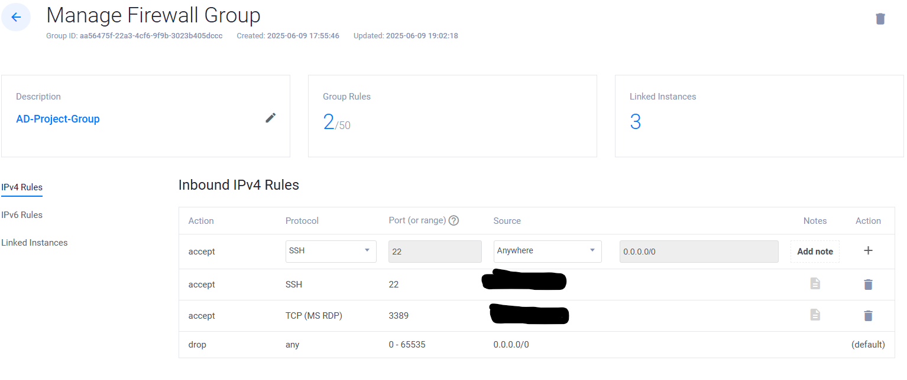
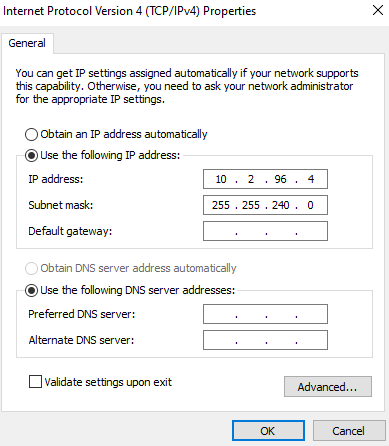
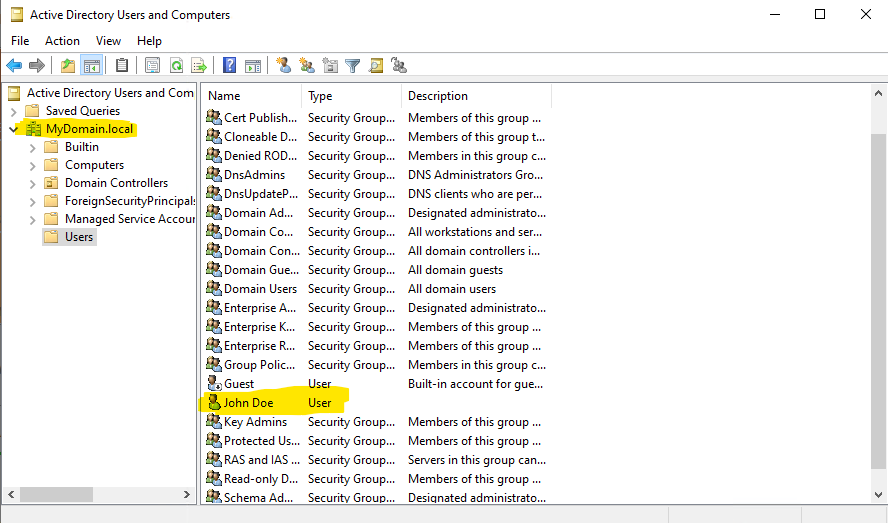
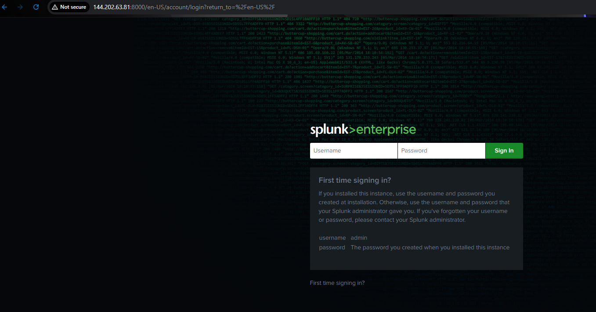
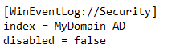
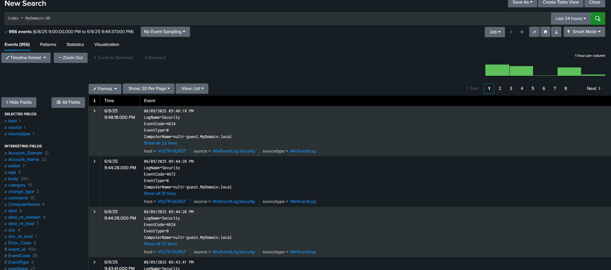
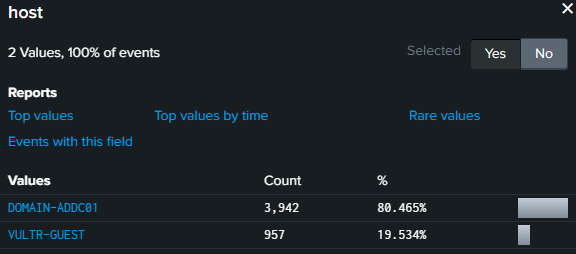

Text can be **bold**, _italic_, ~~strikethrough~~ or `keyword`.

# Introduction

In this project I will be setting up three virtual machines. The first machine will be our domain controller which will be taking responses from our shuffle based on our response as the SOC analyst if we want to disable a users account due to a succesful anuthorized login attempt. Shuffle will automate this task so that we can disable a users account and the domain controller will disable the account through Active Directoy(AD) so that we can disable an account in just one click. The next virtual machine will just be a windows VM that will be open to forms of attack like having the RDP port (3389) open and having weak user credentials to simulate how an attacker could brute force into a users account and gain unauthorized login. The last virtual machine will be a machine to run splunk on an Unbuntu server where the domain controller and the user virtual machine will send telemetry for splunk to collect. Now that the machines our setup and we have an attack vector against our user machine, we are going to setup the alert notifications. I setup splunk to send an alert notification to Slack when there have been attempt of an authorized successful login, aswell as trigger the playbook that I createrd within Shuffle. Our playbook will send an email to us the SOC analyst giving us the choice of if we want to disable the users account within the incident we are reviewing. If I select yes, Shuffle will automate the process and intruct the domain controller to disable the users accont and then will send a notification to Slack that the specified users acocunt was disabled. If I say no to the incident we will do nothing and the users account will stay enabled. 

# Setting Up Machines and Firewall Rules

To start, im using Vultr to create my virtual machines in their cloud platform. After creating the machines I need to setup the machines so that they can communicate with each other and that I am the only one that can communicate with them for the time being. To do this I setup a firewall group to add all of the machines to and created policys to allow me to connect to them from my PC. Below is an image of the basic policy rules I setup to allow me to SSH into the Splunk Ubuntu server and be able to Remote Desktop into the domain controller and user PC. Next im going to setup Virtual Private Cloud(VPC) on the machines so that I can securly isolate the machines while setting them up. Vultr makes this easy and creates a VPC for you for each machine with a click of a button.

Now I want to make sure that the machines can all communicate with one another since the domain controller and the user device will be sending telemtry to the server we are running Splunk on to collect and log the data. I ran into issues when trying to ping the devices to one another. To troubleshoot this I investigated the network interfaces within the machines. The windows machines have the proper public IP for the first network interface, but the second network interface is not the address of the VPC address. To fix this I Remote Desktop into the windows machines and changed the IP address and Subnet Mask to match that of the VPC. Below is an image of me trobleshooting the ping connectivity issues. 

Now that my machines have the proper public and VPC IP address on their network interfaces I tried to ping the machines from one another and was finally able to reach a connetion. 

# Installing and Configuring Active Directory and Promote Domain Controller

On our domain controller machine, I needed to setup Active Directory. I created a new "forest" and created a domain name called "MyDomain" and created a secure password for the controller. Next I want to create a new user account for my user machine to login to with my newly created domain. Below is an image of a user I created name "John Doe" and showing the user inside the forest I created called "MyDomain". 

Now that I have created a new user on the Domian Contrller, I want to connect the user machine to the domain. To do this I went into the window settings and in the "About" settings clicked "Rename this PC (advanced)" and specified the domain as "MyDomain" and logged in with administrator password to proceed and ran into errors. This is because I left the DNS field blank earlier when I was setting up the VPC address. To fix the domain linking issue I set the DNS address to the Active Directory machine VPC address, after trying again I was able to link the user to the Domain. Now I should be able to login with my new user John Doe within my domain by logging in with "MyDomain\JDoe". Before I can Remote login with the John Doe account I have to allow the user to have remote connections and allow this by logging in with admin credentials. 

# Setting Up Splunk and Setting up Windows Telemetry

To setup the Ubuntu server to run splunk we want to go and download the trial version of Splunk Enterprise and download the debian version, to make it easier I just used the Wget command to install it on the command line of my Ubuntu server. After downloading and running Splunk on my server, we need to make some adjustments to the firewall rules. Splunk primarily uses port 8000 to listen so if I want to access splunk web I needed to add a Firewall rule allowing my IP address to allow listening on port 8000 on the Ubuntu server. After that is setup after creating a login for Splunk, below we can see that Splunk is succesfully working on the Ubuntu server by typing in the public IP of the server and logging in with my Splunk credentials. Below is an image of what it should look like after correctly setting it up 

Now that I have Splunk setup and listening on port 8000 from the Ubuntu server, I need to set up telemetry on both the user and domain controller machines. To do this we need to download the Universal Splunk Forwarder on both of the devices, I will walk through how to do it but the steps are the same for both machines. After running the forwarder download on the machine and go through the setup. The important step here is to make sure that you set the recieving indexer the VPC or private IP address of the Ubuntu server and set the port to 9997. This also means that I had to go back to the Ubuntu server and allow the "ufw" to allow port (9997). After this you need to go into the file path of SplunkForwarder and in the local folder add a "input.conf" and add the following to the file. I used a local system account and I had to reset the service of the Splunk Forwarder for anything to take effect.

Since we already added the host rule on the Ubuntu server to allow port (9997) we should be able to go back to our Splunk Enterprise page and be able to see the telemetry from the machine, note that I just had to repeat the steps for both devices as the process is the same. Below is an image of the telemetry I began recieving from the machines. We can see that by filtering for telemetry with the "index = MyDomain" which is the domain we setup in this project. 

Just as another way to confirm that we are recieving telemetry from both of our machines the image below shows the two hosts that we are collecting from in Splunk

